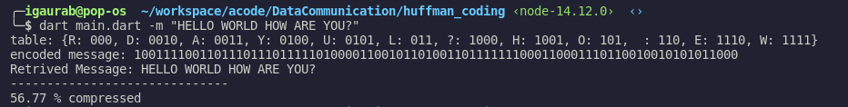

## Huffman Compression

This is an implementation of Huffman Compression Algorithm. 

**Usage:**

You will need to install [dart](https://dart.dev/) to run the program. 

Run `pub get` to get the dependencies(arg parser)

`dart main.dart -m "Hello World!"`

`dart main.dart -m 'He said: "Hello World!"'`

or if you trust, download the binary file `bin/huff` and run

`./huff -m "Hello World!"`

**Hacking**

The `src/utils.dart` contains function

`printLevelOrderTraversal` for Level Order Traversal of Huffman Tree and 

`printLeafNode` to print the leaf nodes of the Huffman Tree from left to right

`char_frequency` : generates the frequency of the characters, from the message

`prob_dist` : calculates the probability distribution based on the `char_frequency`

> If you want to provide these values directly, you can also manually make changes to the `manual.dart` accordingly.

### Example

**TODO**

- Option to read files
- Visualize the Huffman Tree in the console.
